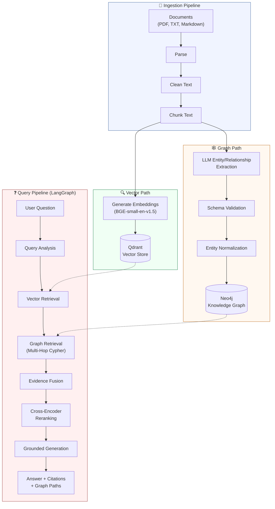
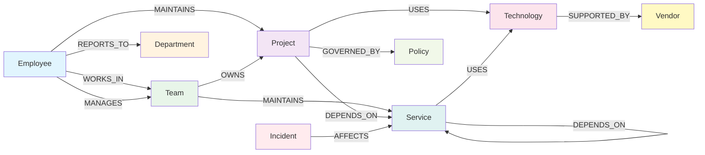

# Enterprise GraphRAG Knowledge Navigator

A GenAI enterprise knowledge assistant that combines **vector retrieval** with **knowledge graph traversal** to answer complex, relationship-heavy questions about organizational knowledge.

Built with FastAPI, Qdrant, Neo4j, LangGraph, and cross-encoder reranking.

---

## Table of Contents

- [The Problem](#the-problem)
- [The Solution](#the-solution)
- [Architecture](#architecture)
- [Technology Stack](#technology-stack)
- [Synthetic Dataset](#synthetic-dataset)
- [Graph Schema](#graph-schema)
- [Ingestion Pipeline](#ingestion-pipeline)
- [Entity Extraction](#entity-extraction)
- [Entity Normalization](#entity-normalization)
- [Vector Retrieval](#vector-retrieval)
- [Graph Retrieval](#graph-retrieval)
- [Multi-Hop Traversal](#multi-hop-traversal)
- [Evidence Fusion](#evidence-fusion)
- [Cross-Encoder Reranking](#cross-encoder-reranking)
- [LangGraph Workflow](#langgraph-workflow)
- [Grounded Generation](#grounded-generation)
- [API Endpoints](#api-endpoints)
- [Local Setup](#local-setup)
- [Example Queries](#example-queries)
- [Evaluation](#evaluation)
- [Tests](#tests)
- [Limitations](#limitations)
- [Future Improvements](#future-improvements)

---

## The Problem

Traditional vector-only RAG retrieves document chunks based on semantic similarity. This works well for many questions, but falls short when the answer requires connecting multiple related facts spread across different documents.

Consider these facts, each appearing in a separate document:

> Bob Chen manages the AI Platform Team.
>
> The AI Platform Team owns Project Atlas.
>
> Project Atlas uses Neo4j.
>
> Neo4j is supported by GraphSphere Technologies.

A question like:

> *"Which vendor supports the technology used by the project owned by Bob Chen's team?"*

requires traversing a **4-hop chain** of relationships:

```
Bob Chen → MANAGES → AI Platform Team → OWNS → Project Atlas → USES → Neo4j → SUPPORTED_BY → GraphSphere Technologies
```

A vector search might retrieve individual chunks about Bob Chen or Project Atlas, but it has no mechanism to traverse the full chain of connections. The embedding space captures semantic similarity, not explicit relational structure.

---

## The Solution

**GraphRAG** (Graph-augmented Retrieval-Augmented Generation) combines two complementary retrieval strategies:

1. **Vector Retrieval** — Semantic search over document chunks using dense embeddings and Qdrant.
2. **Graph Retrieval** — Explicit traversal of a knowledge graph stored in Neo4j, following typed relationships between entities.

At query time, both retrieval paths run, their evidence is fused, reranked by a cross-encoder, and fed to an LLM for grounded answer generation with citations.

---

## Architecture

> For detailed design decisions and component dependencies, see [`docs/architecture.md`](docs/architecture.md).



---

## Technology Stack

| Component | Technology | Purpose |
|---|---|---|
| **Backend Framework** | FastAPI | REST API with async support |
| **Configuration** | Pydantic Settings | Type-safe environment configuration |
| **Vector Store** | Qdrant | Dense vector similarity search |
| **Embedding Model** | `BAAI/bge-small-en-v1.5` | Document and query embedding |
| **Knowledge Graph** | Neo4j 5 | Entity and relationship storage |
| **Graph Queries** | Cypher | Multi-hop graph traversal |
| **Reranker** | `cross-encoder/ms-marco-MiniLM-L-6-v2` | Cross-encoder relevance scoring |
| **Workflow Orchestration** | LangGraph | Stateful query pipeline |
| **LLM (default)** | Ollama (local) | Entity extraction and answer generation |
| **LLM (optional)** | OpenAI API | Alternative LLM provider |
| **LLM (optional)** | Groq API | Free-tier LLM with rate-limit retry and pacing |
| **Document Parsing** | pypdf + stdlib | PDF, TXT, and Markdown support |
| **Testing** | pytest | Unit and integration tests |

---

## Synthetic Dataset

The project includes a synthetic enterprise knowledge base for **Northstar Technologies**, a fictional technology company. The dataset is designed to contain deliberately interconnected facts that support multi-hop graph queries.

### Documents

| File | Description |
|---|---|
| `01_org_structure.md` | Organizational hierarchy — employees, teams, departments, reporting lines |
| `02_project_atlas.md` | Project Atlas — AI platform project details, team, technologies |
| `03_project_ledger.md` | Project Ledger — financial platform project details |
| `04_enterprise_services.md` | Shared enterprise services and their dependencies |
| `05_technology_vendors.md` | Technology vendors and their supported products |
| `06_incidents.md` | Incident reports — outages, affected services, root causes |
| `07_governance_policies.md` | Governance and compliance policies |
| `08_operations.md` | Operations runbooks and maintenance procedures |

### Dataset Characteristics

- **~20–40 entities** across 9 entity types
- **~30–60 relationships** across 10 relationship types
- Deliberately interconnected facts supporting multi-hop traversals
- Realistic enterprise language and structure
- Facts spread across multiple documents to test cross-document reasoning

---

## Graph Schema

The knowledge graph uses a fixed schema with 9 entity types and 10 relationship types.



### Entity Types

| Entity Type | Description | Example |
|---|---|---|
| `Employee` | Individual staff member | Bob Chen, Sarah Kim |
| `Team` | Organizational team | AI Platform Team, Security Team |
| `Department` | Business department | Engineering, Operations |
| `Project` | Named project or initiative | Project Atlas, Project Ledger |
| `Technology` | Technology, tool, or platform | Neo4j, Kubernetes, PostgreSQL |
| `Service` | Enterprise service | Auth Service, Data Pipeline |
| `Vendor` | Technology vendor or supplier | GraphSphere Technologies, CloudScale Inc. |
| `Incident` | Incident or outage | INC-2024-001 |
| `Policy` | Governance or compliance policy | Data Retention Policy |

### Relationship Types

| Relationship | Description | Example |
|---|---|---|
| `WORKS_IN` | Employee belongs to team | Bob Chen → AI Platform Team |
| `MANAGES` | Employee manages team | Bob Chen → AI Platform Team |
| `OWNS` | Team owns project | AI Platform Team → Project Atlas |
| `MAINTAINS` | Employee maintains project / Team maintains service | Alice Morgan → Project Atlas, Platform Team → Auth Service |
| `USES` | Project/service uses technology | Project Atlas → Neo4j |
| `DEPENDS_ON` | Project/service depends on service | Project Atlas → Identity Service |
| `SUPPORTED_BY` | Technology supported by vendor | Neo4j → GraphSphere Technologies |
| `AFFECTS` | Incident affects service | INC-104 → Identity Service |
| `GOVERNED_BY` | Project governed by policy | Project Atlas → AI Data Governance Policy |
| `REPORTS_TO` | Employee reports to department | Bob Chen → CTO Office |

---

## Ingestion Pipeline

The ingestion pipeline converts raw documents into both vector embeddings and a knowledge graph.

### Document Loading

Documents are loaded based on file extension:

- **PDF** → Parsed with `pypdf`, split by pages
- **Markdown** → Read as plain text sections
- **TXT** → Read as plain text

### Text Cleaning

Deterministic text normalization applied to every document:

1. Unicode NFC normalization
2. Normalize line endings to `\n`
3. Collapse 3+ consecutive newlines to 2
4. Collapse repeated whitespace on same line
5. Strip leading/trailing whitespace

### Chunking

Text is split into overlapping chunks for retrieval:

- **Default chunk size:** 1,000 characters
- **Default overlap:** 180 characters
- Each chunk receives a **deterministic ID** based on `SHA-256(document_id:page:index:text)[:24]`
- Chunk metadata includes `document_id`, `document_name`, `page_number`, and `chunk_index`

Overlap ensures that information near chunk boundaries is captured in at least two chunks, preventing loss of context at split points.

---

## Entity Extraction

Entities and relationships are extracted from each document chunk using an LLM with a structured extraction prompt.

### Extraction Process

1. Each chunk is sent to the LLM with a prompt specifying allowed entity types and relationship types.
2. The LLM returns structured JSON with extracted entities and relationships.
3. The response is validated against the graph schema.
4. Invalid entity types, invalid relationship types, empty names, and dangling relationships (referencing non-extracted entities) are rejected.
5. Duplicate entities are removed.
6. If JSON parsing fails, a correction prompt is sent as a retry.

### Validation Rules

- Entity type must be one of the 9 allowed types
- Relationship type must be one of the 10 allowed types
- Both source and target of every relationship must exist in the extracted entity set
- Empty entity names are rejected
- Duplicate entities (same name + type) are deduplicated

---

## Entity Normalization

Entity names are normalized before storage to enable consistent deduplication and lookup.

### Normalization Steps

1. **Unicode NFC normalization** — Canonical decomposition followed by canonical composition
2. **Lowercase** — Case-insensitive matching
3. **Punctuation removal** — Remove all punctuation except hyphens
4. **Whitespace collapse** — Multiple spaces become a single space
5. **Vendor suffix removal** — For `Vendor` entity type only, common corporate suffixes are stripped: `Inc`, `Incorporated`, `Corp`, `Corporation`, `Ltd`, `Limited`, `LLC`

### Entity ID Generation

Each entity receives a deterministic 24-character ID:

```
SHA-256(entity_type:normalized_name)[:24]
```

This ensures the same entity extracted from different chunks will map to the same node in Neo4j, enabling proper graph construction across documents.

---

## Vector Retrieval

Vector retrieval provides semantic search over document chunks.

### How It Works

1. Document chunks are embedded using `BAAI/bge-small-en-v1.5` (384-dimensional vectors).
2. Embeddings are stored in Qdrant with metadata (document ID, document name, page number, chunk text).
3. At query time, the user question is embedded with the same model.
4. Qdrant returns the top-K most similar chunks by **cosine similarity**.
5. Results are converted to `EvidenceItem` objects with `evidence_type="vector"`.

### Configuration

| Parameter | Default | Description |
|---|---|---|
| `EMBEDDING_MODEL` | `BAAI/bge-small-en-v1.5` | Sentence transformer model |
| `QDRANT_COLLECTION` | `enterprise_graphrag_chunks` | Qdrant collection name |
| `VECTOR_TOP_K` | `8` | Number of chunks to retrieve |

---

## Graph Retrieval

Graph retrieval provides explicit relationship traversal from a Neo4j knowledge graph.

### How It Works

1. The query analysis node identifies entity mentions in the user question.
2. Mentioned entities are matched against Neo4j nodes by normalized name (exact match, then partial).
3. For each matched **seed entity**, a bounded multi-hop Cypher traversal is executed.
4. Discovered graph paths are converted to readable text and `EvidenceItem` objects with `evidence_type="graph"`.

### Entity Matching

Entity lookup follows a two-stage strategy:

1. **Exact match** — For each entity type, normalize the query mention and look up by `normalized_name`.
2. **Partial match** — Case-insensitive substring search on the entity `name` field.

---

## Multi-Hop Traversal

Multi-hop traversal is the core mechanism that distinguishes GraphRAG from vector-only retrieval.

### Cypher Query

From each seed entity, a variable-length path query traverses up to `max_hops` relationship hops. When query analysis produces relationship hints, paths are ranked by hint coverage before the `LIMIT` is applied:

```cypher
MATCH (seed:Entity {id: $seed_id})
MATCH p=(seed)-[*1..4]-(connected:Entity)
WITH p,
  size([hint IN $hints WHERE any(r IN relationships(p) WHERE type(r) = hint)]) AS hint_matches
ORDER BY hint_matches DESC, length(p) DESC
LIMIT $max_paths
RETURN p
```

This query:

- Starts from the seed entity
- Follows any relationship type in either direction
- Explores paths from 1 to 4 hops deep
- Ranks paths by how many relationship hints they match
- For multi-hop questions, prefers longer paths on tie; otherwise prefers shorter paths
- Returns at most `max_paths` paths to bound computation

### Path Formatting

Each graph path is converted to human-readable text:

```
Bob Chen -[MANAGES]-> AI Platform Team -[OWNS]-> Project Atlas -[USES]-> Neo4j
```

### Provenance Tracking

Every node and relationship in Neo4j stores `source_chunk_ids` and `source_document_ids`, tracing back to the original document chunks from which they were extracted. This provenance flows through to the final evidence items and citations.

### Configuration

| Parameter | Default | Description |
|---|---|---|
| `GRAPH_MAX_HOPS` | `4` | Maximum traversal depth |
| `GRAPH_MAX_PATHS` | `12` | Maximum paths per seed entity |

---

## Evidence Fusion

After vector and graph retrieval run independently, their results are merged into a single evidence list.

### Merge Strategy

1. Vector evidence items are added first (preserving their retrieval order).
2. Graph evidence items are added next.
3. **Deduplication** is performed by comparing `text.strip().lower()` — if a graph path's text matches a vector chunk's text (case-insensitive), the duplicate is dropped.
4. The merged list preserves the insertion order: vector items first, then graph items.

This ensures both retrieval modalities contribute to the final context without redundancy.

---

## Cross-Encoder Reranking

After fusion, merged evidence is reranked using a cross-encoder model to select the most relevant items for the final LLM context window.

### How It Works

1. Each evidence item is paired with the original user question: `(question, evidence_text)`.
2. The cross-encoder model scores each pair for relevance.
3. Evidence items are sorted by score in descending order.
4. The top-K items are selected for generation.

### Why Reranking Matters

- Vector retrieval scores are based on embedding similarity — fast but approximate.
- Graph paths have no inherent relevance score.
- The cross-encoder performs a deeper semantic comparison between the question and each evidence item, providing a unified relevance ranking across both modalities.

### Configuration

| Parameter | Default | Description |
|---|---|---|
| `RERANKER_MODEL` | `cross-encoder/ms-marco-MiniLM-L-6-v2` | Cross-encoder model |
| `FINAL_CONTEXT_TOP_K` | `6` | Number of evidence items after reranking |

---

## LangGraph Workflow

The query pipeline is orchestrated as a **LangGraph StateGraph** — a directed acyclic graph of processing nodes sharing typed state.

```mermaid
flowchart LR
    START((Start)) --> AQ["analyze_query"]
    AQ --> VR["vector_retrieval"]
    VR --> GR["graph_retrieval"]
    GR --> MC["merge_context"]
    MC --> RC["rerank_context"]
    RC --> GA["generate_answer"]
    GA --> END((End))

    style AQ fill:#e1f5fe,stroke:#0288d1
    style VR fill:#e8f5e9,stroke:#388e3c
    style GR fill:#fff3e0,stroke:#f57c00
    style MC fill:#f3e5f5,stroke:#7b1fa2
    style RC fill:#fce4ec,stroke:#c62828
    style GA fill:#fff9c4,stroke:#f9a825
```



### Workflow Nodes

| Node | Description | Key Operations |
|---|---|---|
| `analyze_query` | Analyze the question with LLM | Classify query type, extract entity mentions, identify relationship hints |
| `vector_retrieval` | Retrieve from Qdrant | Embed question, search top-K similar chunks |
| `graph_retrieval` | Retrieve from Neo4j | Match entities, run multi-hop Cypher traversal |
| `merge_context` | Fuse evidence | Combine vector + graph evidence, deduplicate |
| `rerank_context` | Rerank with cross-encoder | Score all evidence against question, select top-K |
| `generate_answer` | Generate grounded answer | Build prompt with evidence, call LLM, extract citations |

### Shared State

All nodes read from and write to a shared `GraphRAGState` dictionary:

```python
class GraphRAGState(TypedDict, total=False):
    question: str
    query_analysis: dict
    vector_evidence: list
    graph_evidence: list
    merged_evidence: list
    reranked_evidence: list
    answer: str
    citations: list
    graph_paths: list
    errors: list
    mode: str  # "graphrag" or "vector_only"
```

The `mode` field enables a **vector-only baseline**: when set to `"vector_only"`, the `graph_retrieval` node is skipped entirely, allowing direct comparison between vector-only and GraphRAG retrieval.

---

## Grounded Generation

The final answer is generated by an LLM using only the retrieved and reranked evidence.

### Generation Rules

- The LLM must answer using **only** the supplied evidence.
- It must not invent facts or relationships not present in the evidence.
- If the evidence is insufficient, it must say so explicitly.
- For relationship-heavy questions, it should reference graph paths.
- Citations use IDs like `[V1]`, `[V2]` for vector evidence and `[G1]`, `[G2]` for graph evidence.

### Citation Format

Two citation types are returned:

- **Vector citations** — Reference specific document chunks with document name, page number, and chunk ID.
- **Graph citations** — Reference graph traversal paths with the readable path text and source document IDs.

---

## API Endpoints

| Method | Endpoint | Description |
|---|---|---|
| `GET` | `/health` | Health check — reports status of Qdrant and Neo4j |
| `POST` | `/documents/upload` | Upload and ingest a document (PDF, TXT, Markdown) |
| `GET` | `/documents` | List all indexed documents |
| `POST` | `/query` | Execute a full GraphRAG query — returns answer, citations, graph evidence |
| `POST` | `/retrieve` | Debug retrieval — returns all intermediate retrieval stages |
| `GET` | `/graph/entity/{name}` | Look up a specific entity and its neighbors in the knowledge graph |

### Request/Response Examples

**Query:**

```json
{
  "question": "Which vendor supports the technology used by Project Atlas?"
}
```

**Response:**

```json
{
  "answer": "GraphSphere Technologies supports Neo4j, which is the graph database technology used by Project Atlas [G1].",
  "citations": [
    {
      "citation_id": "G1",
      "type": "graph",
      "path": "Project Atlas -[USES]-> Neo4j -[SUPPORTED_BY]-> GraphSphere Technologies",
      "documents": ["doc_05"]
    }
  ],
  "graph_evidence": [
    {
      "path": "Project Atlas -[USES]-> Neo4j -[SUPPORTED_BY]-> GraphSphere Technologies"
    }
  ]
}
```

---

## Local Setup

### Prerequisites

- **Python 3.11+**
- **Docker** and **Docker Compose** (for Qdrant and Neo4j)
- **Ollama** (for local LLM) or an **OpenAI API key** or a **Groq API key** (free tier)

### 1. Clone the Repository

```bash
git clone <repository-url>
cd enterprise-graph-rag-knowledge-navigator
```

### 2. Create a Virtual Environment

```bash
python -m venv venv
source venv/bin/activate  # macOS/Linux
# or
venv\Scripts\activate     # Windows
```

### 3. Install Dependencies

```bash
pip install -r requirements.txt
```

### 4. Start Infrastructure

```bash
docker compose up -d
```

This starts:
- **Qdrant** on `localhost:6333`
- **Neo4j** on `localhost:7474` (browser) and `localhost:7687` (Bolt)

### 5. Configure Environment

```bash
cp .env.example .env
```

Edit `.env` to configure your LLM provider:

**For Ollama (local):**

```env
LLM_PROVIDER=ollama
OLLAMA_BASE_URL=http://localhost:11434
OLLAMA_MODEL=llama3.2
```

**For OpenAI:**

```env
LLM_PROVIDER=openai
OPENAI_API_KEY=sk-your-key-here
OPENAI_MODEL=gpt-4o-mini
```

**For Groq (free tier):**

```env
LLM_PROVIDER=groq
GROQ_API_KEY=gsk-your-key-here
GROQ_MODEL=openai/gpt-oss-20b
```

### 6. Ingest Sample Documents

```bash
python scripts/ingest_sample_data.py
```

This processes all 8 sample documents, creates vector embeddings in Qdrant, and builds the knowledge graph in Neo4j.

### 7. Start the API Server

```bash
uvicorn app.main:app --reload --host 0.0.0.0 --port 8000
```

The API is now available at `http://localhost:8000`. Interactive docs at `http://localhost:8000/docs`.

---

## Example Queries

### Simple Factual Query

```bash
curl -s -X POST http://localhost:8000/query \
  -H "Content-Type: application/json" \
  -d '{"question": "Who manages the AI Platform Team?"}' | python -m json.tool
```

### Multi-Hop Relationship Query

```bash
curl -s -X POST http://localhost:8000/query \
  -H "Content-Type: application/json" \
  -d '{"question": "Which vendor supports the technology used by the project owned by Bob Chen'\''s team?"}' | python -m json.tool
```

### Service Dependency Query

```bash
curl -s -X POST http://localhost:8000/query \
  -H "Content-Type: application/json" \
  -d '{"question": "What services does Project Atlas depend on?"}' | python -m json.tool
```

### Debug Retrieval

Inspect all retrieval stages (runs the full workflow but returns intermediate evidence):

```bash
curl -s -X POST http://localhost:8000/retrieve \
  -H "Content-Type: application/json" \
  -d '{"question": "Who manages the AI Platform Team?"}' | python -m json.tool
```

### Health Check

```bash
curl -s http://localhost:8000/health | python -m json.tool
```

### Upload a New Document

```bash
curl -s -X POST http://localhost:8000/documents/upload \
  -F "file=@path/to/document.pdf" | python -m json.tool
```

### Browse the Knowledge Graph

```bash
curl -s http://localhost:8000/graph/entity/Bob%20Chen | python -m json.tool
```

---

## Evaluation

The project includes two evaluation modes: a **fast retrieval evaluation** and a **full end-to-end evaluation**.

### Fast Retrieval Evaluation (Recommended)

A small, retrieval-focused portfolio benchmark that runs without final LLM answer generation. This requires only ~4 Groq query-analysis calls and produces real, reproducible retrieval metrics.

```bash
python scripts/run_retrieval_evaluation.py
```

- Uses 4 representative questions (1 factual, 1 relationship, 2 multi-hop).
- **Vector-only:** vector retrieval → cross-encoder reranking → evidence hit rate.
- **GraphRAG:** query analysis → vector + graph retrieval → fusion → reranking → evidence hit rate + graph path hit rate.
- The only LLM call per GraphRAG question is query analysis.
- Saves results to `evaluation/results/retrieval_latest.json`.
- Single-question runs are supported: `python scripts/run_retrieval_evaluation.py --question mh_002`
- All metrics are computed from actual retrieval runs — no fabricated numbers.

### Full End-to-End Evaluation (Optional)

The repository also includes an optional comprehensive evaluator that runs the complete pipeline including LLM answer generation for all 16 questions. This requires significantly more API calls and is subject to rate limits on free-tier LLM providers.

```bash
python scripts/run_evaluation.py
```

- Runs each of the 16 questions through both vector-only and GraphRAG modes.
- Measures answer accuracy, evidence hit rate, and graph path hit rate.
- Saves results to `evaluation/results/latest.json`.

### What It Measures

- **Vector-only mode** — Skips graph retrieval; uses only Qdrant semantic search.
- **GraphRAG mode** — Full pipeline with both vector and graph retrieval.
- Questions are categorized by type: factual, semantic, relationship, and multi-hop.
- The retrieval evaluation focuses on whether the correct entities and relationships appear in the retrieved evidence.
- The full evaluation additionally measures whether the LLM generates an accurate answer.

### Evaluation Questions

The fast retrieval evaluation uses 4 carefully chosen questions emphasizing multi-hop relationship chains where GraphRAG is expected to outperform vector-only retrieval. The full evaluation set includes all 16 questions across every query type.

> **Note:** This evaluation uses a small synthetic dataset. Results reflect the behavior of the system on this specific dataset and should not be interpreted as general benchmark claims.

---

## Tests

### Running Tests

```bash
pytest tests/ -v
```

### Test Modules

| Module | What It Tests |
|---|---|
| `test_normalization.py` | Entity name normalization, vendor suffix removal, Unicode handling, ID determinism |
| `test_chunking.py` | Text chunking, overlap, metadata, deterministic IDs, edge cases |
| `test_graph_validation.py` | Extraction validation, schema enforcement, relationship signature validation, deduplication |
| `test_graph_path_formatting.py` | Graph path text formatting, multi-hop paths, path-to-evidence conversion, deduplication |
| `test_fusion.py` | Evidence merging, deduplication, ordering, case-insensitive matching |
| `test_workflow.py` | LangGraph workflow compilation, node registration, state schema |
| `test_correctness_fixes.py` | Path rate denominator, extraction error propagation, evaluation abort, chunk tracking |
| `test_evaluation.py` | Ordered entity matching, graph path hit detection, answer accuracy, evidence hit |
| `test_evaluation_helpers.py` | Evaluation helper functions: path matching, scoring, edge cases |
| `test_extraction_prompt.py` | Extraction prompt content: definitions, examples, anti-hallucination guidance |
| `test_graph_retrieval_quality.py` | Generic seed filtering, hint-based path ranking, provenance precision |
| `test_qdrant_search.py` | Qdrant `query_points()` API usage, vector conversion, payload handling |
| `test_query_analysis.py` | Query type normalization (hyphenated, mixed case, unknown fallback) |
| `test_query_normalization.py` | Query type enum parsing edge cases |
| `test_llm_provider.py` | LLM factory routing, provider validation, Groq configuration |
| `test_groq_client.py` | Groq JSON mode, reasoning settings, rate-limit retry, custom token limits |
| `test_groq_pacing.py` | Groq evaluation pacing, delay between runs, no pacing for Ollama/OpenAI |
| `test_hint_normalization.py` | Relationship hint alias resolution, deduplication, unknown removal |
| `test_retrieval_evaluation.py` | Retrieval evaluation: question selection, no generation, metrics, CLI filtering |

All tests run without requiring external services (no Qdrant, Neo4j, or LLM needed) — they test pure business logic functions.

---

## Limitations

This project is a portfolio-grade demonstration. The following limitations apply:

- **LLM extraction quality** — Entity and relationship extraction depends on LLM accuracy. The LLM may miss entities, misclassify entity types, or hallucinate relationships not stated in the source text.

- **Entity normalization** — The normalization pipeline handles obvious naming variants (case, whitespace, punctuation, common corporate suffixes) but is not enterprise-grade entity resolution. It will not resolve abbreviations, nicknames, or complex aliases.

- **Bounded traversal trade-offs** — Graph traversal is bounded to a configurable maximum depth (default: 4 hops) and maximum paths (default: 12). In dense graphs, this may return irrelevant paths, while in sparse graphs it may miss important connections.

- **Synthetic dataset** — The included dataset is intentionally small and synthetic (~8 documents, ~20–40 entities). It is designed to demonstrate the architecture, not to represent production-scale data volumes.

- **Document update/delete lineage** — There is no mechanism to selectively remove or update entities and relationships when a source document is re-ingested or deleted. Full re-ingestion is required.

- **Cross-encoder latency** — The cross-encoder reranker introduces additional latency at query time. For latency-sensitive applications, the reranking model or top-K parameter may need tuning.

- **Query entity identification** — Entity mentions are extracted from the user question using a lightweight LLM prompt. This may miss implicit references or struggle with ambiguous names.

- **Single-threaded extraction** — Graph extraction processes chunks sequentially. For large document sets, this can be slow.

- **No authentication** — The API has no authentication or authorization. It is intended for local development and demonstration only.

---

## Future Improvements

The following enhancements are planned but not yet implemented:

- **Conditional LangGraph routing** — Route queries to different subgraphs based on query type (e.g., skip graph retrieval for purely semantic questions).

- **Improved entity resolution** — Implement abbreviation expansion and embedding-based entity linking for more robust entity deduplication.

- **Full-text Neo4j indexes** — Add full-text search indexes in Neo4j for faster and more flexible entity matching.

- **Document update/delete lineage** — Track entity and relationship provenance at the chunk level to support incremental document updates and deletions.

- **Larger enterprise datasets** — Expand the synthetic dataset or integrate with real enterprise knowledge bases to stress-test the pipeline.

- **Batch extraction** — Parallelize LLM extraction calls across chunks for faster ingestion.

- **Observability** — Add structured logging, OpenTelemetry tracing, and metrics collection for pipeline monitoring.

- **Authentication and RBAC** — Add API authentication and role-based access control for multi-user deployments.

- **Production deployment** — Containerize the application, add health checks, and provide Kubernetes manifests or Docker Compose production profiles.

---

## Project Structure

```
Enterprise GraphRAG Knowledge Navigator/
├── app/
│   ├── main.py                    # FastAPI application entry point
│   ├── api/
│   │   ├── dependencies.py        # Shared API dependencies
│   │   └── routes/
│   │       ├── health.py          # Health check endpoint
│   │       ├── documents.py       # Document upload and listing
│   │       ├── query.py           # Query and retrieve endpoints
│   │       └── graph.py           # Graph entity lookup
│   ├── core/
│   │   ├── config.py              # Pydantic Settings configuration
│   │   ├── logging.py             # Structured logging setup
│   │   └── exceptions.py          # Custom exception classes
│   ├── models/
│   │   ├── domain.py              # Domain models, enums, Pydantic schemas
│   │   └── schemas.py             # API request/response schemas
│   ├── ingestion/
│   │   ├── loaders.py             # Document loading (PDF, TXT, MD)
│   │   ├── cleaner.py             # Text cleaning and normalization
│   │   ├── chunker.py             # Text chunking with overlap
│   │   └── pipeline.py            # End-to-end ingestion pipeline
│   ├── embeddings/
│   │   └── service.py             # Embedding model service
│   ├── vectorstore/
│   │   └── qdrant_store.py        # Qdrant vector store operations
│   ├── graph/
│   │   ├── schema.py              # Graph schema validation
│   │   ├── normalization.py       # Entity name normalization
│   │   ├── extraction.py          # LLM-based entity/relationship extraction
│   │   ├── neo4j_store.py         # Neo4j operations and Cypher queries
│   │   └── retrieval.py           # Graph path retrieval and formatting
│   ├── retrieval/
│   │   ├── vector.py              # Vector-only retrieval
│   │   ├── fusion.py              # Evidence fusion (vector + graph)
│   │   └── reranker.py            # Cross-encoder reranking
│   ├── generation/
│   │   ├── llm.py                 # LLM client abstraction
│   │   ├── prompts.py             # Prompt templates
│   │   └── citations.py           # Citation generation
│   └── workflow/
│       ├── state.py               # LangGraph state definition
│       ├── nodes.py               # LangGraph workflow nodes
│       └── graph.py               # LangGraph StateGraph compilation
├── data/
│   └── sample_docs/               # Synthetic enterprise documents (8 files)
├── evaluation/
│   ├── questions.json             # 16 evaluation questions (4 per category)
│   ├── evaluator.py               # Full end-to-end evaluation engine
│   ├── retrieval_evaluator.py     # Fast retrieval-focused evaluation
│   └── results/                   # Generated evaluation results
├── scripts/
│   ├── ingest_sample_data.py      # Batch ingestion script
│   ├── run_evaluation.py          # Full evaluation runner
│   └── run_retrieval_evaluation.py # Fast retrieval evaluation runner
├── tests/
│   ├── __init__.py
│   ├── test_normalization.py      # Entity normalization tests
│   ├── test_chunking.py           # Text chunking tests
│   ├── test_correctness_fixes.py  # Evaluation correctness and integrity tests
│   ├── test_evaluation.py         # Core evaluation metric tests
│   ├── test_evaluation_helpers.py # Evaluation helper function tests
│   ├── test_extraction_prompt.py  # Extraction prompt content tests
│   ├── test_fusion.py             # Evidence fusion tests
│   ├── test_graph_path_formatting.py  # Graph path formatting tests
│   ├── test_graph_retrieval_quality.py # Seed filtering, hint ranking, provenance
│   ├── test_graph_validation.py   # Schema and signature validation tests
│   ├── test_groq_client.py        # Groq JSON mode, retry, token limits
│   ├── test_groq_pacing.py        # Evaluation pacing for Groq free tier
│   ├── test_hint_normalization.py # Relationship hint alias resolution
│   ├── test_llm_provider.py       # LLM factory and provider tests
│   ├── test_qdrant_search.py      # Qdrant query_points API tests
│   ├── test_query_analysis.py     # Query type normalization tests
│   ├── test_query_normalization.py # Query type enum edge cases
│   ├── test_retrieval_evaluation.py # Fast retrieval evaluation tests
│   └── test_workflow.py           # LangGraph workflow tests
├── docs/
│   └── architecture.md            # Architecture documentation
├── docker-compose.yml             # Qdrant + Neo4j services
├── requirements.txt               # Python dependencies
├── .env.example                   # Environment variable template
└── README.md                      # This file
```

---

## License

This project is licensed under the [MIT License](LICENSE). See individual dependency licenses for third-party components.
