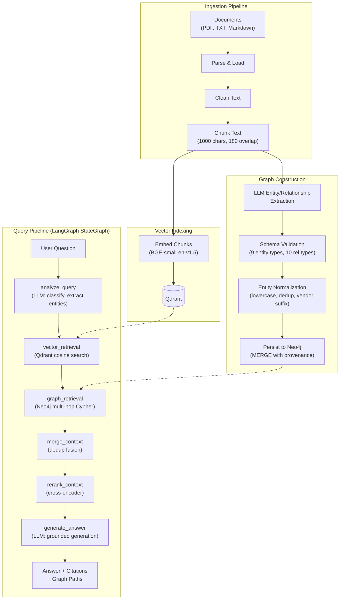
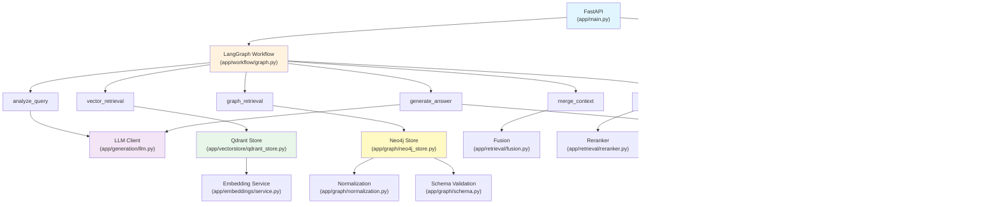

# Architecture — Enterprise GraphRAG Knowledge Navigator

This document describes the high-level architecture and key design decisions for the Enterprise GraphRAG Knowledge Navigator.

---

## System Overview

The system has two major pipelines:

1. **Ingestion Pipeline** — Converts documents into vector embeddings (Qdrant) and a knowledge graph (Neo4j).
2. **Query Pipeline** — Orchestrates retrieval from both stores, fuses evidence, reranks, and generates a grounded answer.



---

## Design Decisions

### 1. Dual Retrieval (Vector + Graph)

**Decision:** Maintain two independent retrieval paths and fuse their results.

**Rationale:** Vector retrieval excels at semantic similarity but cannot traverse explicit relationships. Graph retrieval provides deterministic relationship chains but requires pre-extracted structure. By combining both, the system handles both semantic and relational questions.

**Alternative considered:** A single unified retrieval layer using graph embeddings (e.g., TransE, Node2Vec). Rejected because it conflates the two retrieval modalities and is harder to debug and explain.

### 2. Fixed Graph Schema

**Decision:** Use a fixed set of 9 entity types and 10 relationship types defined as Python enums.

**Rationale:** A fixed schema enables:
- Deterministic validation of LLM extraction output
- Consistent Cypher queries
- Predictable graph structure for traversal

**Trade-off:** The schema cannot represent entity types outside the predefined set. For a broader deployment, the schema would need to be configurable.

### 3. LLM-Based Extraction (Not NER)

**Decision:** Use a general-purpose LLM with structured prompting for entity and relationship extraction, rather than a dedicated NER model.

**Rationale:** LLMs can extract both entities and relationships in a single pass, handle the full context of each chunk, and adapt to the specific entity types defined in the schema. A dedicated NER model would require separate relationship extraction and may not generalize to the custom entity types.

**Trade-off:** LLM extraction is slower and less deterministic than NER. Extraction quality depends on the LLM capability and prompt engineering.

### 4. Deterministic Entity IDs

**Decision:** Generate entity IDs as `SHA-256(entity_type:normalized_name)[:24]`.

**Rationale:** Deterministic IDs ensure that the same entity extracted from different chunks maps to the same Neo4j node. This enables automatic entity merging without a separate resolution step. The 24-character hex prefix provides sufficient uniqueness (~96 bits).

### 5. LangGraph for Orchestration

**Decision:** Use LangGraph StateGraph to orchestrate the query pipeline.

**Rationale:** LangGraph provides:
- Explicit, inspectable workflow as a directed graph
- Shared typed state across all nodes
- Easy addition of conditional routing in the future
- Compile-time validation of the workflow structure

**Alternative considered:** Simple sequential function calls. Rejected because LangGraph's explicit graph structure is more maintainable and extensible, and demonstrates orchestration patterns relevant to production GenAI systems.

### 6. Cross-Encoder Reranking

**Decision:** Rerank fused evidence using a cross-encoder model before generation.

**Rationale:** Vector retrieval scores and graph path presence are not directly comparable. A cross-encoder scores each `(question, evidence)` pair on a unified scale, providing a principled way to select the most relevant evidence from both modalities.

**Trade-off:** Adds latency at query time proportional to the number of evidence items scored. For latency-critical applications, the top-K parameter can be reduced or reranking can be replaced with score-based thresholding.

### 7. Bounded Graph Traversal

**Decision:** Limit Cypher traversal to a maximum of 4 hops and 12 paths per seed entity.

**Rationale:** Unbounded traversal in a connected graph can produce an exponential number of paths. The bounds prevent query explosion while still supporting the 4-hop questions in the evaluation set.

**Configuration:** Both `GRAPH_MAX_HOPS` and `GRAPH_MAX_PATHS` are configurable via environment variables.

### 8. Provenance Tracking

**Decision:** Store `source_chunk_ids` and `source_document_ids` on every Neo4j node and relationship.

**Rationale:** Provenance enables:
- Citations that trace back to specific document chunks
- Debugging extraction issues
- Future support for incremental document updates

### 9. Vector-Only Baseline Mode

**Decision:** Support a `vector_only` mode that skips graph retrieval.

**Rationale:** A fair evaluation of GraphRAG requires comparison against a vector-only baseline using the same infrastructure. The `mode` field in the LangGraph state controls whether graph retrieval is executed.

---

## Data Flow

### Ingestion Flow

```
Raw Document
  → load_document() → (document_id, sections)
  → clean_text() → cleaned text
  → chunk_text() → list[DocumentChunk]
  → embed_chunks() → Qdrant points (384-dim vectors)
  → extract_graph_from_text() → GraphExtraction
  → validate_extraction() → filtered entities/relationships
  → normalize_entity_name() → normalized names
  → compute_entity_id() → deterministic IDs
  → neo4j.persist_extraction() → Neo4j MERGE operations
```

### Query Flow

```
User Question
  → analyze_query: LLM extracts entity mentions, query type, relationship hints
  → vector_retrieval: embed question → Qdrant search → EvidenceItem[]
  → graph_retrieval: entity mentions → Neo4j match → multi-hop Cypher → EvidenceItem[]
  → merge_context: deduplicate vector + graph evidence
  → rerank_context: cross-encoder scores all (question, evidence) pairs → top-K
  → generate_answer: LLM generates answer from reranked evidence → answer + citations
```

---

## Component Dependencies



---

## Key Files Reference

| File | Purpose |
|---|---|
| `app/workflow/graph.py` | LangGraph StateGraph definition and compilation |
| `app/workflow/nodes.py` | All 6 workflow node implementations |
| `app/workflow/state.py` | GraphRAGState TypedDict definition |
| `app/graph/neo4j_store.py` | All Neo4j operations including multi-hop Cypher traversal |
| `app/graph/extraction.py` | LLM extraction prompt + validation |
| `app/graph/normalization.py` | Entity name normalization + ID generation |
| `app/retrieval/fusion.py` | Vector + graph evidence merging |
| `app/retrieval/reranker.py` | Cross-encoder reranking service |
| `app/generation/prompts.py` | Query analysis and generation prompt templates |
| `app/core/config.py` | All configurable parameters via Pydantic Settings |
